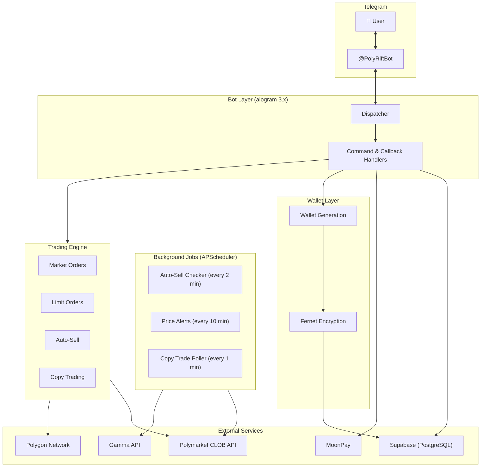

# PolyRift

## Architecture


> Full diagram in [`docs/architecture.mmd`](docs/architecture.mmd)

A Telegram bot for trading on [Polymarket](https://polymarket.com) prediction markets. Place orders, copy top traders, track your portfolio, and manage crypto wallets — all from a Telegram chat.

## Features

**Trading**
- Market and limit orders (buy/sell YES or NO outcomes)
- Auto-sell at target price
- 1% fee per trade

**Wallet Management**
- Automatic Polygon wallet generation per user
- Private keys encrypted at rest with Fernet
- USDC.e balance checking
- Deposit via MoonPay integration

**Copy Trading**
- Follow any wallet address
- Fixed amount or percentage-of-balance modes
- Max per trade cap
- Pause, resume, or stop anytime
- Background polling for new trades

**Portfolio & Analytics**
- Live positions with real-time PnL
- Sentiment bars and expiry warnings
- Trade history and activity log
- Leaderboard with opt-in display names and win streaks

**Background Jobs**
- Auto-sell checker (every 2 min)
- Price alerts on 10%+ moves (every 10 min)
- Copy trade polling (every 1 min)

## Tech Stack

| Component | Technology |
|-----------|-----------|
| Bot framework | [aiogram 3.x](https://docs.aiogram.dev/) |
| Trading | [py-clob-client](https://github.com/Polymarket/py-clob-client) (Polymarket CLOB API) |
| Blockchain | [web3.py](https://web3py.readthedocs.io/) (Polygon network) |
| Database | [Supabase](https://supabase.com/) (PostgreSQL) |
| Scheduling | APScheduler |
| Encryption | Fernet (cryptography library) |
| Deployment | PM2 on Linux VPS |

## Setup

### Prerequisites
- Python 3.10+
- A Telegram bot token from [@BotFather](https://t.me/BotFather)
- A Supabase project
- Polymarket CLOB API credentials

### Installation
```bash
git clone https://github.com/Trahgic/polyrift.git
cd polyrift
python -m venv venv
source venv/bin/activate
pip install -r requirements.txt
```

### Configuration

Copy the example env file and fill in your credentials:
```bash
cp .env.example .env
nano .env
```

See `.env.example` for all required variables.

### Running
```bash
# development
python bot.py

# production (with PM2)
pm2 start start.sh --name polyrift-bot
```

## Security

- All private keys are Fernet-encrypted before storage
- Keys are only decrypted in memory during transactions
- Supabase Row Level Security enabled
- Service role key used server-side only
- Ownership verification on all sensitive actions (trades, copy trading, order cancellation)
- Rate limiting on withdrawals and financial operations
- No secrets in source code — all credentials loaded from environment variables

## Roadmap

- [ ] Referral system
- [ ] Gas relay (cover user gas fees)
- [ ] Advanced order types
- [ ] Multi-chain support
- [ ] Web dashboard

## Links

- Telegram: [@PolyRiftBot](https://t.me/PolyRiftBot)
- Twitter: [@polyrift](https://twitter.com/polyrift)
- Domain: [polyrift.xyz](https://polyrift.xyz)

## Attribution

If you fork or deploy this bot, please credit PolyRift and link back to this repo. Built by [@polyrift](https://twitter.com/polyrift).

## License

MIT
